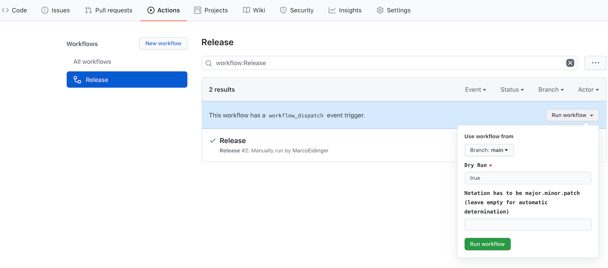
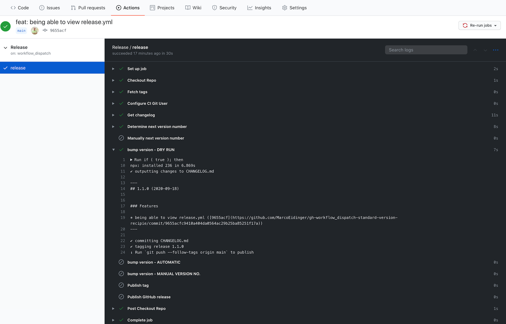
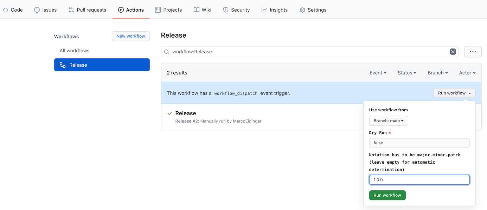
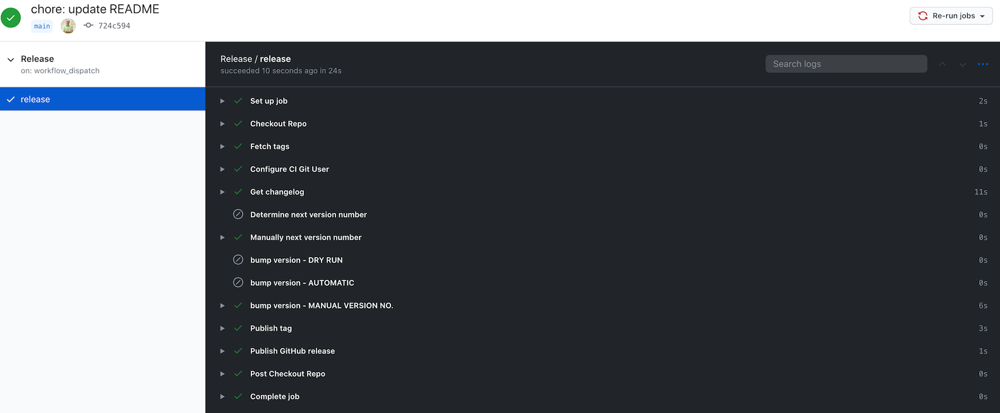
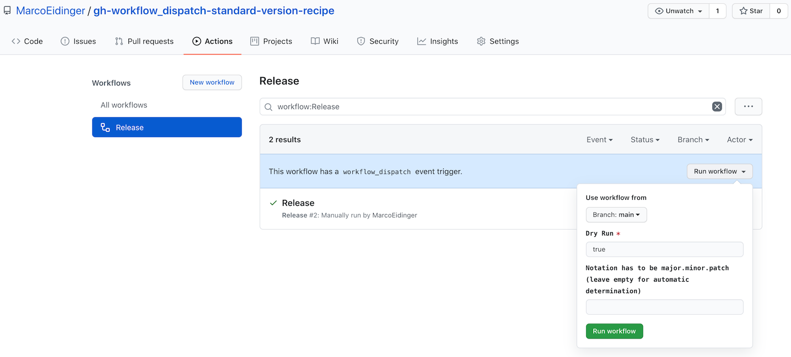
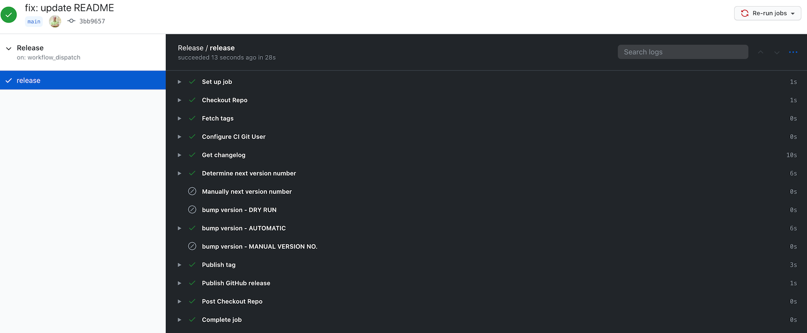
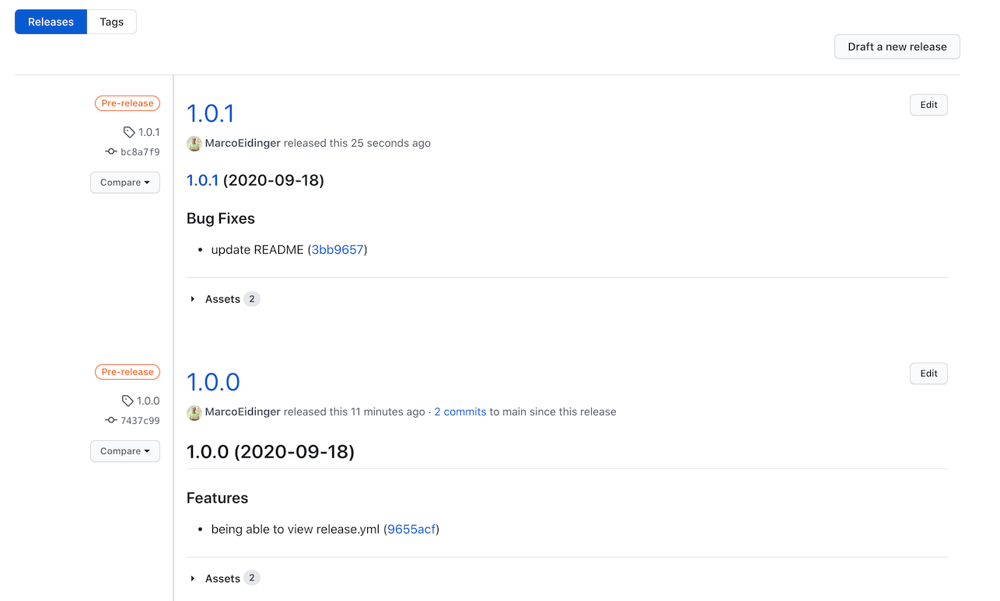
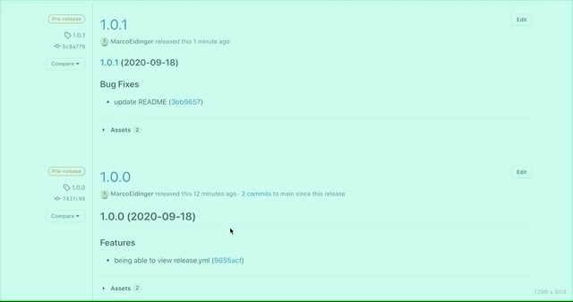

# gh-workflow_dispatch-standard-version-recipe
Demo / Playground for a recipe on how to create a workflow, that can be manually triggered, and create a release with https://github.com/conventional-changelog/standard-version

If you are a fan of [conventional commits](https://www.conventionalcommits.org/en/v1.0.0/) and want to semi-automate your release process then this recipe might help to get you started.

## Code

File [release.yml](./github/workflows/release.yml)

## Usage

### Dry Run

### Set Version Number

### Auto-determine Version Number

The generated changelog provides a link to quickly compare a release with its previous release

